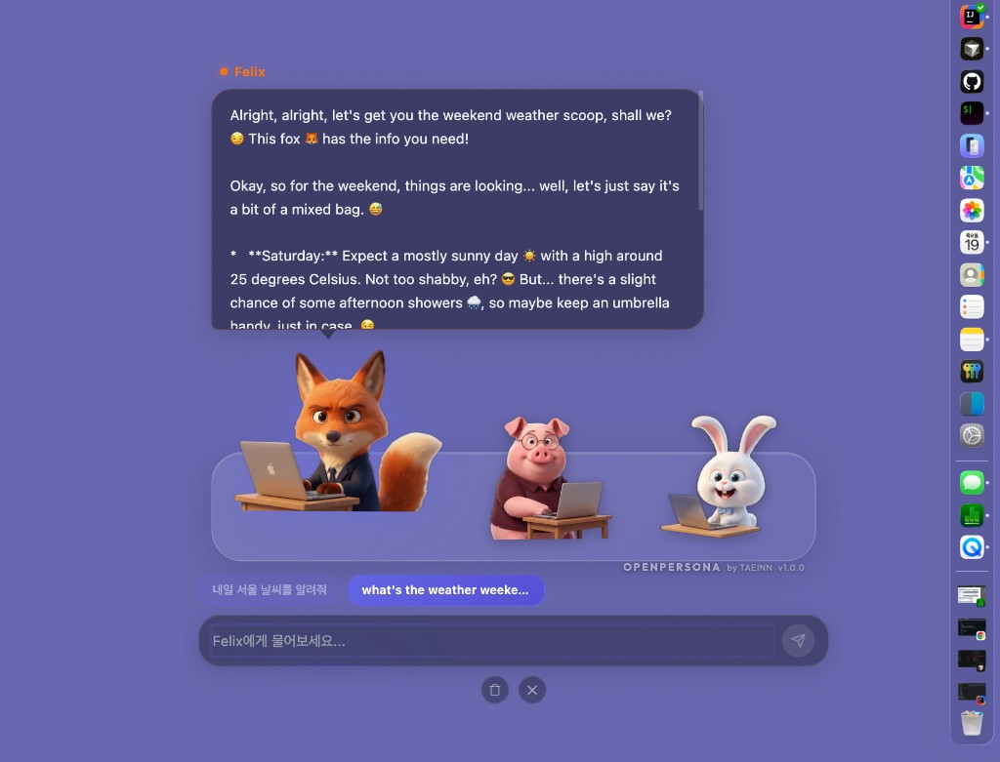

# OpenPersona

#### by TAEINN

---

**RAG-powered macOS Desktop AI Agent with Expert Character Personas.**
Disney/Pixar-style characters sit at the bottom of your screen—each with specialized expertise backed by Retrieval-Augmented Generation (RAG), an orchestration engine, file system tools, 9 animated expressions, idle talk bubbles, continuous learning, and smart Gemini-first model selection.

**RAG 기반 전문가 캐릭터를 탑재한 macOS 데스크톱 AI 에이전트.**
디즈니/픽사 스타일 캐릭터가 화면 하단에서 말풍선으로 대화하며, 각 캐릭터의 전문 지식을 RAG(검색 증강 생성)로 강화합니다. 오케스트레이션 엔진, 파일시스템 도구, 9가지 표정 애니메이션, 아이들 토크, 지속 학습, Gemini 우선 스마트 모델 선택을 지원합니다.

---



## Architecture / 아키텍처

```
┌───────────────────────────────────────────────────────────────┐
│                      Renderer (React 18)                       │
│                                                                │
│  ┌──────────┐  ┌──────────┐  ┌──────────┐  ┌──────────────┐  │
│  │ BubbleUI │  │  Upload  │  │ Feedback │  │    Panels    │  │
│  │ + Image  │  │ (file/   │  │ (👍/✏️)  │  │ Token / Sys  │  │
│  │  Attach  │  │  image)  │  │          │  │   Monitor    │  │
│  └────┬─────┘  └────┬─────┘  └────┬─────┘  └──────┬───────┘  │
│       │              │              │                │          │
│  ┌────▼──────────────▼──────────────▼────────────────▼──────┐  │
│  │  CharacterScene (9 expressions × 3 chars + idle talk)    │  │
│  │  Question Chips · Copy Toast · Idle Talk Overlay         │  │
│  └──────────────────────────┬───────────────────────────────┘  │
│                              │ IPC Bridge                       │
└──────────────────────────────┼─────────────────────────────────┘
                               │
┌──────────────────────────────▼─────────────────────────────────┐
│                      Main Process (Electron)                    │
│                                                                 │
│  ┌───────────────────── Orchestrator ────────────────────────┐  │
│  │                                                            │  │
│  │  1. Intent        2. RAG Engine       3. Model Selector    │  │
│  │     Classifier       (Hybrid Search      (Gemini-first     │  │
│  │     (keyword +        + Reranking)         + fallback)     │  │
│  │      context)                                              │  │
│  │        │                  │                    │            │  │
│  │        ▼                  ▼                    ▼            │  │
│  │  4. Context         5. Tool Call        6. LLM Router      │  │
│  │     Builder            Loop               Gemini Flash     │  │
│  │     (RAG inject)       (max 5 rounds      Gemini Pro       │  │
│  │                         + 30s timeout     GPT-4o / Mini    │  │
│  │                         + guardrails)      + quickCall     │  │
│  │                                                            │  │
│  └────────────────────────────────────────────────────────────┘  │
│                                                                 │
│  ┌──────────────┐  ┌──────────────┐  ┌────────────────────┐    │
│  │  RAG Engine  │  │  FS Tools ×8 │  │  Learning Manager  │    │
│  │ Vectra Index │  │ + Guardrails │  │  Memory · Feedback │    │
│  │ LRU Cache    │  │ + Timeout    │  │  · Knowledge Upload│    │
│  └──────────────┘  └──────────────┘  └────────────────────┘    │
│                                                                 │
│  ┌──────────────┐  ┌──────────────┐                             │
│  │ TokenTracker │  │ MemoryGuard  │                             │
│  │ 90d prune    │  │ RSS monitor  │                             │
│  │ async I/O    │  │              │                             │
│  └──────────────┘  └──────────────┘                             │
└─────────────────────────────────────────────────────────────────┘
```

---

## Features / 주요 기능

### Expert Character AI Chatbots (RAG-Powered) / 전문가 캐릭터 AI 챗봇 (RAG 기반)

| Character | Name | Expertise | RAG Knowledge |
|-----------|------|-----------|---------------|
| 🦊 Fox | Felix | Developer + QA Expert | TypeScript, React/Next.js, Code Review, Design QA, Functional QA |
| 🐷 Pig | Done | Document Expert | Excel Functions/Charts, PowerPoint Design, Word, HWP (Korean) |
| 🐰 Rabbit | Bomi | Translation Expert | KO↔EN, KO↔JA Translation Patterns, Grammar Rules, Style Guides |

| 캐릭터 | 이름 | 전문 분야 | RAG 지식 |
|---------|------|-----------|----------|
| 🦊 여우 | Felix | 개발 + QA 전문가 | TypeScript, React/Next.js, 코드 리뷰, 디자인 QA, 기능 QA |
| 🐷 돼지 | Done | 문서 전문가 | Excel 함수/차트, PowerPoint 디자인, Word, 한글(HWP) |
| 🐰 토끼 | Bomi | 번역 전문가 | 한↔영, 한↔일 번역 패턴, 문법 규칙, 스타일 가이드 |

All characters share:
- **File System Access**: Read, write, create, delete, move, copy files and directories
- **Image Analysis**: Analyze uploaded screenshots and images (multimodal)
- **Continuous Learning**: Improve over time from conversations, feedback, and uploads
- **9 Expressions**: default, blink, happy, surprised, sleepy, love, wink, pout, thinking
- **Idle Talk**: Random cute speech bubbles when characters are idle
- **Suggested Questions**: Help prompts and example question chips for new users

모든 캐릭터 공통 기능:
- **파일시스템 접근**: 파일 및 디렉토리 읽기, 쓰기, 생성, 삭제, 이동, 복사
- **이미지 분석**: 업로드된 스크린샷 및 이미지를 분석 (멀티모달)
- **지속 학습**: 대화, 피드백, 업로드를 통해 시간이 지남에 따라 개선
- **9가지 표정**: 기본, 깜빡, 행복, 놀람, 졸림, 사랑, 윙크, 삐침, 생각
- **아이들 토크**: 캐릭터가 가만히 있을 때 랜덤으로 귀여운 말풍선 표시
- **추천 질문**: 처음 사용하는 사용자를 위한 도움말 및 예시 질문 칩

### Orchestration-Based Architecture / 오케스트레이션 기반 아키텍처

The Orchestrator automatically handles every request through:
1. **Intent Classification** — Keyword + context analysis to determine what the user needs
2. **RAG Search** — Hybrid search (vector + BM25 keyword) with LLM reranking
3. **Smart Model Selection** — Gemini-first with automatic fallback on quota errors
4. **Context Building** — Injects RAG knowledge + character persona into system prompts
5. **Tool Call Loop** — Executes file operations with safety guardrails (up to 5 rounds, 30s timeout)
6. **Session Reset** — Tool call counters auto-reset per conversation turn

오케스트레이터가 모든 요청을 자동으로 처리합니다:
1. **의도 분류** — 키워드 + 컨텍스트 분석으로 사용자의 의도 파악
2. **RAG 검색** — 하이브리드 검색 (벡터 + BM25 키워드) + LLM 리랭킹
3. **스마트 모델 선택** — Gemini 우선, 할당량 초과 시 자동 폴백
4. **컨텍스트 구성** — RAG 지식 + 캐릭터 페르소나를 시스템 프롬프트에 주입
5. **도구 호출 루프** — 안전 가드레일과 함께 파일 작업 실행 (최대 5회, 30초 타임아웃)
6. **세션 리셋** — 대화 턴마다 도구 호출 카운터 자동 초기화

### RAG Pipeline (Hybrid Search + Reranking) / RAG 파이프라인 (하이브리드 검색 + 리랭킹)

- **Embedding**: OpenAI `text-embedding-3-small` (1536 dimensions)
- **Vector DB**: Vectra LocalIndex (file-backed, zero infrastructure)
- **Chunking**: Structure-Aware custom chunker (500 tokens + 50 token overlap)
- **Search**: Vector similarity + BM25 keyword → RRF (Reciprocal Rank Fusion) merge
- **Reranking**: Gemini Flash lightweight LLM reranking for top-K selection
- **Caching**: LRU cache (20 entries, 500 chunks/entry) with dummy vector reuse

- **임베딩**: OpenAI `text-embedding-3-small` (1536차원)
- **벡터 DB**: Vectra LocalIndex (파일 기반, 인프라 불필요)
- **청크 분할**: 구조 인식 커스텀 청커 (500토큰 + 50토큰 오버랩)
- **검색**: 벡터 유사도 + BM25 키워드 → RRF (역순위 퓨전) 병합
- **리랭킹**: Gemini Flash 경량 LLM 리랭킹으로 Top-K 선별
- **캐싱**: LRU 캐시 (최대 20개 항목, 항목당 500청크) + 더미 벡터 재사용

### Smart Model Selection (Gemini-First) / 스마트 모델 선택 (Gemini 우선)

Gemini is prioritized for all tasks for cost efficiency. If Gemini quota is exhausted, the orchestrator automatically falls back to OpenAI.

비용 효율을 위해 모든 작업에 Gemini를 우선 사용합니다. Gemini 할당량이 소진되면 오케스트레이터가 자동으로 OpenAI로 폴백합니다.

| Task | Primary | Fallback | Reason |
|------|---------|----------|--------|
| Code Review / Generation | Gemini 2.0 Flash | GPT-4o | Cost-efficient, auto-fallback |
| Image Analysis | Gemini 2.0 Flash | GPT-4o | Multimodal support |
| Translation | Gemini 2.0 Flash | GPT-4o Mini | Excellent multilingual |
| Document Generation | Gemini 2.0 Flash | GPT-4o Mini | Fast + low cost |
| General Chat | Gemini 2.0 Flash | GPT-4o Mini | Fastest response |
| RAG Reranking | Gemini 2.0 Flash | — | Lightweight reranking |

| 작업 | 기본 모델 | 폴백 모델 | 이유 |
|------|-----------|-----------|------|
| 코드 리뷰 / 생성 | Gemini 2.0 Flash | GPT-4o | 비용 효율적, 자동 폴백 |
| 이미지 분석 | Gemini 2.0 Flash | GPT-4o | 멀티모달 지원 |
| 번역 | Gemini 2.0 Flash | GPT-4o Mini | 우수한 다국어 성능 |
| 문서 생성 | Gemini 2.0 Flash | GPT-4o Mini | 빠름 + 저비용 |
| 일반 채팅 | Gemini 2.0 Flash | GPT-4o Mini | 가장 빠른 응답 |
| RAG 리랭킹 | Gemini 2.0 Flash | — | 경량 리랭킹 |

### Learning System / 학습 시스템

Characters continuously improve through:
- **Conversation Memory**: Quality Q&A pairs extracted and stored in learned Vectra index
- **User Feedback**: Thumbs up/down and corrections feed into knowledge base
- **Knowledge Upload**: Users can upload `.xlsx`, `.docx`, `.md`, `.txt`, `.json` files

캐릭터는 다음을 통해 지속적으로 개선됩니다:
- **대화 기억**: 양질의 Q&A 쌍을 추출하여 학습 Vectra 인덱스에 저장
- **사용자 피드백**: 좋아요/싫어요 및 수정 사항이 지식 베이스에 반영
- **지식 업로드**: `.xlsx`, `.docx`, `.md`, `.txt`, `.json` 파일 업로드 가능

### Tool System with Guardrails / 가드레일을 갖춘 도구 시스템

- 8 file system tools: `readFile`, `writeFile`, `listDirectory`, `createDirectory`, `deleteFile`, `moveFile`, `copyFile`, `fileInfo`
- **Safety**: Blocked system paths, file size limits (10MB), session call limits (20/turn, auto-reset)
- **Timeout**: 30-second execution limit per tool call
- **Large File Protection**: `readFile` uses `FileHandle` to read only 50KB instead of loading entire files
- **Confirmation**: Destructive operations (delete, move, write) flag for user confirmation

- 8가지 파일시스템 도구: `readFile`, `writeFile`, `listDirectory`, `createDirectory`, `deleteFile`, `moveFile`, `copyFile`, `fileInfo`
- **안전성**: 시스템 경로 차단, 파일 크기 제한 (10MB), 세션당 호출 제한 (20회/턴, 자동 리셋)
- **타임아웃**: 도구 호출당 30초 실행 제한
- **대용량 파일 보호**: `readFile`이 `FileHandle`을 사용해 전체 파일 대신 50KB만 읽기
- **확인 요청**: 삭제, 이동, 쓰기 등 위험 작업 시 사용자 확인 플래그

### Memory & Performance Safety / 메모리 및 성능 안전성

- **TokenTracker**: 90-day auto-pruning, async file I/O, flush deduplication
- **RAG Cache**: LRU eviction (20 entries max), 500 chunks/entry cap, singleton dummy vector
- **LLM Providers**: AbortController on both Gemini and OpenAI — previous streams abort on new calls
- **Renderer**: `useSafeTimers` for all setTimeout chains, `isMounted` guards on async state updates, single CSS injection via `injectStyleOnce`
- **Orchestrator**: 30-message context window, tool session auto-reset, quota-error fallback
- **Shutdown**: Full cleanup — timers, abort controllers, LLM dispose, RAG dispose, memory guard stop

- **TokenTracker**: 90일 자동 프루닝, 비동기 파일 I/O, flush 중복 방지
- **RAG 캐시**: LRU 제거 방식 (최대 20개), 항목당 500청크 제한, 싱글턴 더미 벡터
- **LLM 프로바이더**: Gemini와 OpenAI 모두 AbortController 적용 — 새 호출 시 이전 스트림 자동 중단
- **렌더러**: 모든 setTimeout 체인에 `useSafeTimers`, 비동기 상태 업데이트에 `isMounted` 가드, `injectStyleOnce`로 CSS 단일 주입
- **오케스트레이터**: 30메시지 컨텍스트 윈도우, 도구 세션 자동 리셋, 할당량 오류 시 폴백
- **종료 시**: 타이머, AbortController, LLM dispose, RAG dispose, 메모리 가드 정리 등 완전 정리

### UI Features / UI 기능

- **9 Character Expressions** with weighted probability profiles per character
  - Fox: frequent winks & thinking, fast cycle (4–9s)
  - Pig: lots of love & sleepy, relaxed cycle (5–12s)
  - Rabbit: energetic surprised & happy, rapid cycle (3–7s)
- **Idle Talk Bubbles**: Random cute messages when characters are idle (20–40s intervals)
- **Suggested Question Chips**: Example prompts appear when users ask for help
- **Speech-Bubble Chat** with glassmorphism design
- **Image/File Attachment** via clip button or drag-and-drop
- **Tool Execution Status** display during operations
- **System Tray** with model switching
- **Monitoring Panels**: Token usage tracking with monthly budget gauge, system memory/CPU stats with mini-graphs and leak detection
- **Character-Specific Error Messages**: Friendly, persona-matched error responses instead of raw API errors

- **캐릭터별 가중치 기반 9가지 표정**
  - 여우: 윙크 & 생각 빈도 높음, 빠른 주기 (4–9초)
  - 돼지: 사랑 & 졸림 빈도 높음, 느긋한 주기 (5–12초)
  - 토끼: 놀람 & 행복 빈도 높음, 빠른 주기 (3–7초)
- **아이들 토크 말풍선**: 캐릭터가 가만히 있을 때 랜덤 귀여운 메시지 (20–40초 간격)
- **추천 질문 칩**: 사용자가 도움을 요청하면 예시 질문 표시
- **말풍선 채팅**: 글래스모피즘 디자인
- **이미지/파일 첨부**: 클립 버튼 또는 드래그 앤 드롭
- **도구 실행 상태**: 작업 중 실행 상태 표시
- **시스템 트레이**: 모델 전환 기능
- **모니터링 패널**: 월간 예산 게이지와 함께 토큰 사용량 추적, 미니 그래프 및 누수 감지와 함께 시스템 메모리/CPU 통계
- **캐릭터별 오류 메시지**: 원시 API 오류 대신 캐릭터 성격에 맞는 친근한 에러 응답

---

## Tech Stack / 기술 스택

| Area / 영역 | Stack / 스택 |
|------|-------|
| Framework / 프레임워크 | Electron + Electron Forge |
| UI | React 18 + TypeScript |
| State / 상태관리 | Zustand |
| LLM | Google Gemini (`@google/genai`), OpenAI (`openai`) |
| RAG | Vectra (Vector DB), OpenAI Embeddings, BM25, RRF, LLM Reranking |
| Document Parsing / 문서 파싱 | ExcelJS, Mammoth (DOCX) |
| Build / 빌드 | Webpack 5 |
| Styling / 스타일링 | CSS (glassmorphism, CSS animations, 9 expression overlays) |
| Versioning / 버전 관리 | Changesets |
| License / 라이선스 | Apache-2.0 |

---

## Project Structure / 프로젝트 구조

```
src/
├── main/                              # Electron 메인 프로세스
│   ├── main.ts                        # 부트스트랩: LLM, RAG, Orchestrator 초기화 + 종료 정리
│   ├── tray.ts                        # 시스템 트레이 메뉴
│   ├── ipc-handlers.ts                # IPC: 채팅, 피드백, 지식, 토큰, 정리 함수 export
│   └── services/
│       ├── llm/
│       │   ├── llm-router.ts          # 멀티 프로바이더 LLM 라우터 + quickCall
│       │   ├── gemini-provider.ts     # Gemini: 멀티모달 + 도구 호출 + AbortController
│       │   ├── openai-provider.ts     # OpenAI: 멀티모달 + 도구 호출 + AbortController
│       │   └── types.ts              # ContentPart, ToolCallInfo 등
│       ├── rag/
│       │   ├── rag-engine.ts          # 코어: 인덱싱 + 하이브리드 검색 + 리랭킹 + LRU 캐시
│       │   ├── chunker.ts            # 구조 인식 청커 (500+50 토큰)
│       │   ├── keyword-search.ts     # BM25 키워드 검색 + RRF 병합
│       │   ├── reranker.ts           # Gemini Flash LLM 리랭커
│       │   ├── knowledge-loader.ts   # 정적 지식 부트스트랩
│       │   ├── types.ts              # DocumentChunk, SearchResult 등
│       │   ├── ports/
│       │   │   ├── vector-store.port.ts  # VectorStorePort 인터페이스
│       │   │   └── embedding.port.ts     # EmbeddingPort 인터페이스
│       │   ├── adapters/
│       │   │   ├── vectra.adapter.ts     # Vectra LocalIndex 어댑터
│       │   │   └── openai-embedding.adapter.ts  # OpenAI 임베딩 어댑터
│       │   └── document-loader/
│       │       ├── index.ts           # 통합 문서 로더
│       │       ├── excel-loader.ts    # .xlsx → Markdown 테이블
│       │       └── docx-loader.ts     # .docx → Markdown
│       ├── orchestrator/
│       │   ├── orchestrator.ts        # 코어: 의도 → RAG → 모델 → 도구 + 세션 리셋
│       │   ├── intent-classifier.ts   # 키워드 기반 의도 분류
│       │   ├── model-selector.ts      # Gemini 우선 모델 선택 + 폴백
│       │   ├── context-builder.ts     # 시스템 프롬프트 + RAG 컨텍스트 주입
│       │   └── types.ts
│       ├── tools/
│       │   ├── tool-registry.ts       # 도구 등록 + 실행 + 30초 타임아웃
│       │   ├── fs-tools.ts            # 8가지 파일시스템 도구 (대용량 파일은 FileHandle)
│       │   ├── tool-guardrails.ts     # 안전: 경로 차단, 크기 제한, 호출 카운터
│       │   └── types.ts
│       ├── learning/
│       │   ├── learning-manager.ts    # 대화 기억, 피드백, 업로드
│       │   └── types.ts
│       ├── token-tracker.ts           # 90일 프루닝, 비동기 I/O, flush 중복 방지
│       └── memory-guard.ts            # RSS 모니터링 + GC 트리거
├── renderer/                          # Electron 렌더러 (React)
│   ├── App.tsx                        # 루트: 오버레이, 버전 표시
│   ├── assets.d.ts                    # 이미지 모듈 선언
│   ├── global.d.ts                    # Window.electronAPI 타입
│   ├── components/
│   │   ├── chat/BubbleChat.tsx       # 채팅 입력 + 파일 첨부 + 질문 칩
│   │   ├── scene/CharacterScene.tsx  # 9표정 × 3캐릭터 + 아이들 토크 + 안전 타이머
│   │   └── panel/
│   │       ├── TokenUsagePanel.tsx   # 토큰 통계 + 예산 게이지 + isMounted 가드
│   │       └── SystemMonitorPanel.tsx # 메모리/CPU 모니터 + 누수 감지 + isMounted 가드
│   ├── hooks/
│   │   ├── use-chat.ts              # 채팅 + 피드백 + 지식 업로드
│   │   └── use-agent.ts             # 에이전트 상태 + 모델 목록
│   └── stores/agent-store.ts        # Zustand: 메시지, 캐릭터, 토스트, 아이들 토크
├── preload/preload.ts                # IPC 브릿지
└── shared/
    ├── types.ts
    └── character-personas.ts         # 페르소나: 프롬프트, 아이들 토크, 오류 메시지, 추천 질문

assets/
├── characters/                       # 캐릭터 PNG (9표정 × 3캐릭터 = 27장)
│   ├── fox.png, fox-blink.png, fox-happy.png, fox-surprised.png, ...
│   ├── pig.png, pig-blink.png, pig-happy.png, pig-surprised.png, ...
│   └── rabbit.png, rabbit-blink.png, rabbit-happy.png, rabbit-surprised.png, ...
├── knowledge/                        # 정적 RAG 지식 베이스
│   ├── fox/                          # Felix: 개발 + QA 전문 지식
│   │   ├── code-review/
│   │   ├── design-qa/
│   │   ├── functional-qa/
│   │   ├── typescript/
│   │   └── react-nextjs/
│   ├── pig/                          # Done: 문서 전문 지식
│   │   ├── excel/
│   │   ├── powerpoint/
│   │   ├── word/
│   │   └── hwp/
│   └── rabbit/                       # Bomi: 번역 전문 지식
│       ├── ko-en/
│       ├── en-ko/
│       ├── ja-ko/
│       └── style-guides/
└── icons/
```

---

## Setup & Run / 설치 및 실행

### Requirements / 요구 사항

- Node.js 18+
- pnpm

### Install / 설치

```bash
pnpm install
```

### Environment / 환경 변수

Create a `.env` in the project root:

프로젝트 루트에 `.env` 파일을 생성하세요:

```env
GEMINI_API_KEY=your_gemini_api_key
OPENAI_API_KEY=your_openai_api_key
```

- **Gemini** (recommended / 권장): Primary model for all tasks — fast, cost-efficient. Get a key at [Google AI Studio](https://aistudio.google.com).
  모든 작업의 기본 모델 — 빠르고 비용 효율적. [Google AI Studio](https://aistudio.google.com)에서 키를 발급받으세요.
- **OpenAI** (optional / 선택): Used for RAG embeddings and as fallback when Gemini quota is exhausted. Get a key at [OpenAI Platform](https://platform.openai.com).
  RAG 임베딩 및 Gemini 할당량 소진 시 폴백으로 사용. [OpenAI Platform](https://platform.openai.com)에서 키를 발급받으세요.
- At minimum, a Gemini API key is required for chat functionality.
  최소한 Gemini API 키가 있어야 채팅 기능을 사용할 수 있습니다.

### Run / 실행

```bash
pnpm start
```

### Build / 빌드

```bash
pnpm make
```

---

## Adding a Character / 캐릭터 추가하기

1. Add 9 expression images under `assets/characters/` (transparent PNGs):
   `<id>.png`, `<id>-blink.png`, `<id>-happy.png`, `<id>-surprised.png`, `<id>-sleepy.png`, `<id>-love.png`, `<id>-wink.png`, `<id>-pout.png`, `<id>-thinking.png`
2. Add a persona in `src/shared/character-personas.ts` (system prompt, idle talks, error messages, suggested questions)
3. Register the character in `DEFAULT_CHARACTERS` in `src/renderer/stores/agent-store.ts`
4. Add an `ExpressionProfile` in `src/renderer/components/scene/CharacterScene.tsx`
5. Import all 9 expression images in `CharacterScene.tsx` and add to `CHARACTER_IMAGES`
6. Add static knowledge in `assets/knowledge/<character-id>/` (Markdown files)
7. Add intent rules in `src/main/services/orchestrator/intent-classifier.ts`

1. `assets/characters/` 아래에 9가지 표정 이미지를 추가 (투명 배경 PNG):
   `<id>.png`, `<id>-blink.png`, `<id>-happy.png`, `<id>-surprised.png`, `<id>-sleepy.png`, `<id>-love.png`, `<id>-wink.png`, `<id>-pout.png`, `<id>-thinking.png`
2. `src/shared/character-personas.ts`에 페르소나 추가 (시스템 프롬프트, 아이들 토크, 오류 메시지, 추천 질문)
3. `src/renderer/stores/agent-store.ts`의 `DEFAULT_CHARACTERS`에 캐릭터 등록
4. `src/renderer/components/scene/CharacterScene.tsx`에 `ExpressionProfile` 추가
5. `CharacterScene.tsx`에서 9개 표정 이미지를 import하고 `CHARACTER_IMAGES`에 추가
6. `assets/knowledge/<character-id>/`에 정적 지식 추가 (Markdown 파일)
7. `src/main/services/orchestrator/intent-classifier.ts`에 의도 분류 규칙 추가

---

## Data Flow / 데이터 흐름

### RAG-Augmented Chat / RAG 증강 채팅 (예: Done이 Excel 질문에 답변)

```
User: "VLOOKUP이랑 INDEX/MATCH 차이가 뭐야?"
  ↓
Intent Classifier → knowledge_query (category: excel)
의도 분류기 → 지식 쿼리 (카테고리: excel)
  ↓
RAG Engine → Hybrid Search (vector + BM25)
RAG 엔진 → 하이브리드 검색 (벡터 + BM25)
  → Vectra: pig/static index (excel category)
  → Keyword: "VLOOKUP", "INDEX", "MATCH" exact match
  → RRF Merge → Gemini Flash Reranking → Top 5 chunks
  → RRF 병합 → Gemini Flash 리랭킹 → 상위 5개 청크
  ↓
Context Builder → System prompt + RAG context injection
컨텍스트 빌더 → 시스템 프롬프트 + RAG 컨텍스트 주입
  ↓
Model Selector → Gemini 2.0 Flash (Gemini-first policy)
모델 셀렉터 → Gemini 2.0 Flash (Gemini 우선 정책)
  ↓
LLM Response → Streaming to UI
LLM 응답 → UI로 스트리밍
```

### Multimodal Translation / 멀티모달 번역 (예: Bomi가 스크린샷 번역)

```
User: "이 이미지를 한국어로 번역해줘" + [screenshot.png]
  ↓
Intent Classifier → translation (hasImage: true)
의도 분류기 → 번역 (이미지 포함: true)
  ↓
RAG Engine → ko-en/en-ko translation patterns
RAG 엔진 → 한↔영 번역 패턴 검색
  ↓
Model Selector → Gemini 2.0 Flash (multimodal, Gemini-first)
모델 셀렉터 → Gemini 2.0 Flash (멀티모달, Gemini 우선)
  ↓
Context Builder → RAG patterns + image attachment
컨텍스트 빌더 → RAG 패턴 + 이미지 첨부
  ↓
Gemini Flash → Reads image + applies RAG translation rules → Response
Gemini Flash → 이미지 읽기 + RAG 번역 규칙 적용 → 응답
  (fallback → GPT-4o if Gemini quota exceeded)
  (Gemini 할당량 초과 시 → GPT-4o로 폴백)
```

### Tool Calling / 도구 호출 (예: Felix가 파일 생성)

```
User: "새 React 컴포넌트 파일 만들어줘"
  ↓
Intent Classifier → code_generation (needsTool: true)
의도 분류기 → 코드 생성 (도구 필요: true)
  ↓
Orchestrator → resetSession() (tool call counter reset)
오케스트레이터 → resetSession() (도구 호출 카운터 리셋)
  ↓
Model Selector → Gemini 2.0 Flash (Gemini-first)
모델 셀렉터 → Gemini 2.0 Flash (Gemini 우선)
  ↓
LLM → Tool Call: writeFile(path, content)
LLM → 도구 호출: writeFile(경로, 내용)
  ↓
Tool Guardrails → Validate path, size
도구 가드레일 → 경로, 크기 검증
  → Promise.race(execute, 30s timeout)
  → Promise.race(실행, 30초 타임아웃)
  ↓
Tool Result → Feed back to LLM → Final response
도구 결과 → LLM에 피드백 → 최종 응답
```

---

## Shortcuts / 단축키

| Shortcut / 단축키 | Action / 동작 |
|----------|--------|
| `Cmd+Shift+Space` | Toggle character show/hide / 캐릭터 표시/숨기기 |
| `Enter` | Send message / 메시지 전송 |
| `Esc` | Close chat / 채팅 닫기 |

---

## Roadmap / 로드맵

- [x] Phase 1: RAG + Orchestrator + Tool Calling + Learning System
  1단계: RAG + 오케스트레이터 + 도구 호출 + 학습 시스템
- [x] Phase 1.5: 9 Expressions, Idle Talk, Memory/Performance Optimization, Gemini-First
  1.5단계: 9가지 표정, 아이들 토크, 메모리/성능 최적화, Gemini 우선
- [ ] Phase 2: MCP (Model Context Protocol) integration for external services
  2단계: 외부 서비스 연동을 위한 MCP (Model Context Protocol) 통합
- [ ] Phase 2: Figma MCP, Google Drive MCP, GitHub MCP connections
  2단계: Figma MCP, Google Drive MCP, GitHub MCP 연결
- [ ] Phase 2: Advanced tool confirmation UI
  2단계: 고급 도구 확인 UI
- [ ] Phase 3: Voice input/output support
  3단계: 음성 입출력 지원

---

## License / 라이선스

Copyright 2025-2026 JUNGTAEINN

Licensed under the **Apache License, Version 2.0** (the "License");
you may not use this file except in compliance with the License.
You may obtain a copy of the License at

**Apache License, Version 2.0** (이하 "라이선스")에 따라 사용이 허가됩니다.
라이선스를 준수하지 않는 한 이 파일을 사용할 수 없습니다.
라이선스 사본은 다음에서 얻을 수 있습니다:

> http://www.apache.org/licenses/LICENSE-2.0

Unless required by applicable law or agreed to in writing, software
distributed under the License is distributed on an "AS IS" BASIS,
WITHOUT WARRANTIES OR CONDITIONS OF ANY KIND, either express or implied.
See the License for the specific language governing permissions and
limitations under the License.

관련 법률에서 요구하거나 서면으로 합의하지 않는 한, 라이선스에 따라 배포되는 소프트웨어는
명시적이든 묵시적이든 어떠한 종류의 보증이나 조건 없이 "있는 그대로" 배포됩니다.
라이선스에 따른 특정 언어의 권한 및 제한 사항은 라이선스를 참조하세요.

**이 프로젝트를 사용하거나 파생 작업물을 배포할 때 반드시 원작자(JUNGTAEINN)를 표기해야 합니다.**
